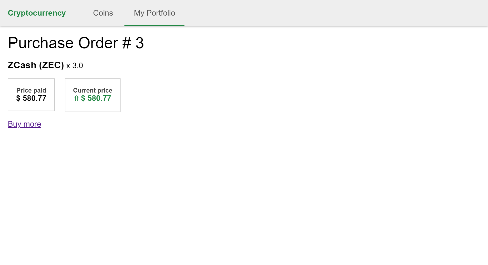

# cryptocurrency-portfolio
Simple app to learn Ruby on Rails

## Introduction
This project should do two main things:

1. Show some coins and their USD prices;
2. Show the coins the user has bought, the quantity, and USD value of each order.

## Planning
There are two main entities:

1. Coin: with a Name (ex: "BTC"), a CoinName (ex: "Bitcoin") and USD price. Since they change a lot, and the webservices (coinapi.io or cryptocompare.com) impose a limit of requests, the coins will be stored in a cache. If possible, there will be a background scheduled process to fetch coins values, so we don't need to impose the webservice delay in the user's request.
2. Order: each user will have some orders, with the coin name, and the quantity bought. The total value of an order will be calculated based on current coin price.

## Build & Run

Ruby version 2.4.4
Rails version 5.2.0
Redis version 3.2.100

Install rest_client:
```
gem install rest-client
```

Run with:
```
bin/rails server
```
on Windows with:
```
ruby bin\rails server
```

Now open your browser at: http://localhost:3000

## Screenshots

Coin list:


Buy:


Purchase order:


My Portfolio:


## Things to do

 - Fetching the coins price from the webservice in a background task, so it doesn't take time from the user request.

 - Adding [authentication](http://guides.rubyonrails.org/getting_started.html#basic-authentication) or adding this project to another bigger one, which already has a [user management](http://guides.rubyonrails.org/security.html#user-management). Then, each Purchase Order must belong to a user.

 - Adding some kind of a management area for the coins, so the admin could select some coins to show and sell, and to see some stats about users, like how much dolars they've spent, or how many coins they have.
